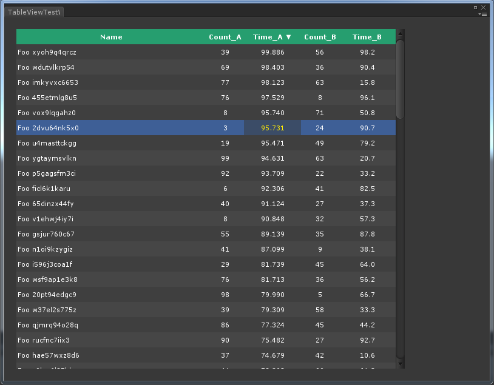

# TableView

## Screenshot



## Features

`TableView` browses data set in a neat table view in Unity Editor.  

- easy-to-use interface for minimal learning time
    + less than 10 lines of code to get it working 
- data browsing and selecting
    + get the selected data and colomn from the `OnSelected` event 
- data sorting by titlebar-clicking 
    + ascending & descending for each column without providing comparing function
- smart scrolling and clipping for large data set
    + only visible data are rendered in the target area
- full detail control if you want to  
    + line height, cell width, cell alignment, value formatting, etc... 

## A Minimal Sample  

A typical table is built in 3 steps:

1. create the table object and setup columns  
    ``` cs
    // create the table with a specified object type
    _table = new TableView(this, typeof(FooItem));

    // setup the description for content
    _table.AddColumn("Name", "Name", 0.5f, TextAnchor.MiddleLeft);
    _table.AddColumn("Count_A", "Count_A", 0.1f);
    _table.AddColumn("Time_A", "Time_A", 0.15f, TextAnchor.MiddleCenter, "0.000");
    ```  
    
2. add test data  
    ``` cs
    // add test data
    List<object> entries = new List<object>();
    for (int i = 0; i < 100; i++)
        entries.Add(FooItem.MakeRandom());
    _table.RefreshData(entries);
    ```  
    
3. add event handler   
    ``` cs
    // register the event-handling function
    _table.OnSelected += TableView_Selected;
    ```  

## History

- [v1.0.6 released](https://github.com/PerfAssist/PA_TableView/releases/tag/v1.0.6) [2016-11-25]
    + add highlight for selected title cell; set cell as bold when selected
- [v1.0.5 released](https://github.com/PerfAssist/PA_TableView/releases/tag/v1.0.5) [2016-11-18]
    + add new class UniqueString: support client-side string interning
- [v1.0.4 released](https://github.com/PerfAssist/PA_TableView/releases/tag/v1.0.4) [2016-11-10]
    + add new interfaces SetSortParams / SetSelected / GetSelected
- [v1.0.3 released](https://github.com/PerfAssist/PA_TableView/releases/tag/v1.0.3) [2016-11-10]
    + data items could be cleared by passing `null` or an empty list
    + use delay-init to prevent `EditorStyles.xxx` from being accessing too early
- [v1.0.2 released](https://github.com/PerfAssist/PA_TableView/releases/tag/v1.0.2) [2016-11-08]  
    + rely on `PA_Common` now
    + some common functions are merged into `PA_Common`
    + directory name changed (add prefix `PA_`)
- [2016-10-14] initial version
