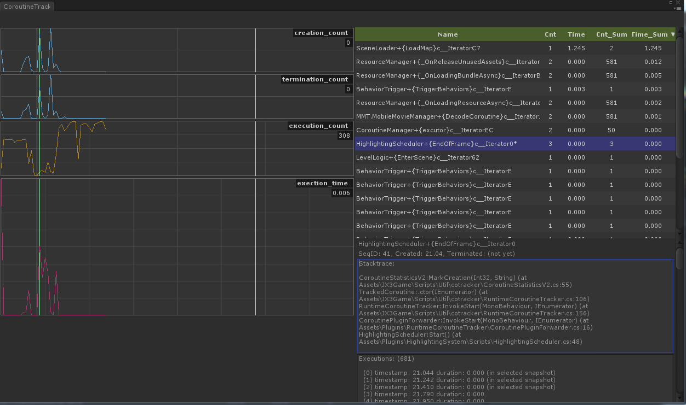
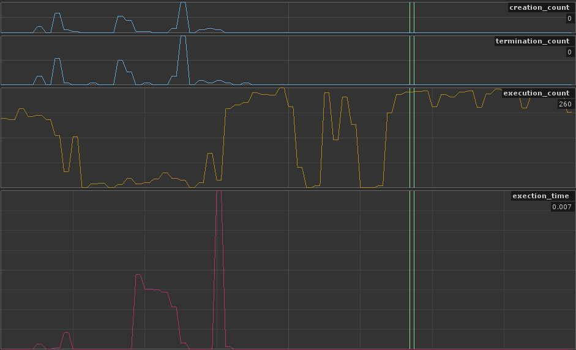
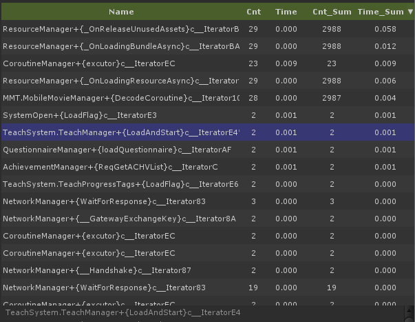
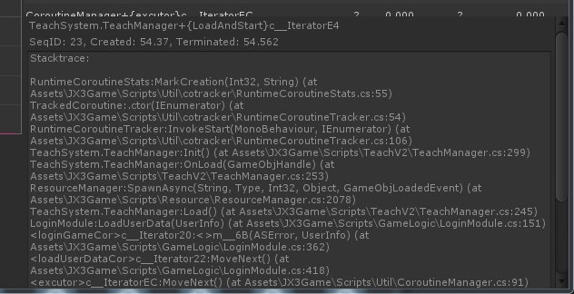
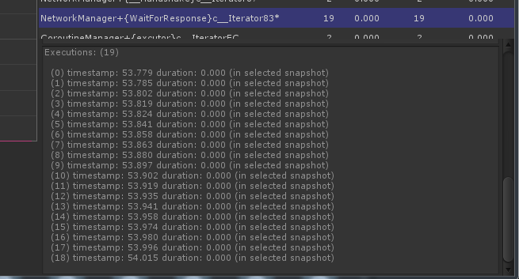

# CoroutineTracker (PerfAssist)

Check out [this page](http://gulu-dev.com/post/perf_assist/2016-12-20-unity-coroutine-optimizing) for an optimization guide of Unity coroutines.

- [Unity 协程运行时的监控和优化](http://gulu-dev.com/post/perf_assist/2016-12-20-unity-coroutine-optimizing)



### 功能介绍

左边的四列是程序运行时所有被追踪协程的实时的启动次数，结束次数，执行次数和执行时间。



当点击图形上任何一个位置时，选中该时间点（秒为单位），在图形上是绿色竖条。
 
此时右边的数据报表刷新为在这一秒中活动的所有协程的列表，如下图所示：



注意，该表中的数据依次为：
  
- 协程的完整修饰名 (mangled name)  
- 在选定时间段内的执行次数 (selected execution count)  
- 在选定时间段内的执行时间 (selected execution time)  
- 到该选中时间为止时总的执行次数 (summed execution count)  
- 到该选中时间为止时总的执行时间 (summed execution time)  

可以通过表头对每一列的数据进行排序。
 
当选中列表中某一个协程时，面板的右下角会显示该协程的详细信息，如下图所示：



这里有下面的信息：
  
- 该协程的序列 ID (sequence ID)  
- 启动时间 (creation time)  
- 结束时间 (termination time)  
- 启动时堆栈 (creation stacktrace)  
 
向下滚动，可看到该协程的完整执行流程信息，如下图所示：
 


### 常见问题调查

使用这个工具，我们可以更方便地调查下面的问题： 
  
- yield 过于频繁的  
- 单次运行时间太久的  
- 总时间开销太高的  
- 进入死循环，始终未能正确结束掉的  
- 递归 yield 产生过深执行层次的  

## Journals

[2016-09-22] 功能改进

- 支持插件内 (Plugins) 的协程追踪 (新增类 CoroutinePluginForwarder)
- 处理 Profiler 输出时的乱码问题

[2016-09-20] 增加 `RuntimeCoroutineTracker` 类，对协程的行为进行追踪和记录

- **性能分析** 目前支持对每一个协程的每一次 yield 过程执行 `BeginSample()`/ `EndSample()` 
- **统计输出** 可以知道程序任意时间点上运行着多少活动的协程

如果希望新写出来的协程可以被追踪，需要把普通形式的协程调用

```cs
abc.StartCoroutine(xxx());
```

使用如下的调用方式替换

```cs
RuntimeCoroutineTracker.InvokeStart(abc, xxx());
```

注意这两种调用方式在未开启追踪的情况下的行为完全一致。

